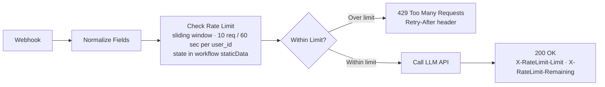

# LLM10: Rate Limiter

**OWASP Risk:** LLM10:2025 Unbounded Consumption  
**Source:** [OWASP LLM Top 10 v2.0](../../reference/owasp-llm-top10-v2.0.md)  
**Complexity:** Low

---

## What it does

Enforces per-user sliding-window rate limits on LLM API calls before they reach the model. Each incoming request is checked against a rolling 60-second window. Requests within the limit are forwarded to the LLM API and returned with rate limit headers. Requests over the limit receive a `429 Too Many Requests` response with a `Retry-After` header indicating when the window resets.

This is an application-layer control, enforced in the workflow before the model is ever invoked. A model cannot rate-limit itself.



---

## Who it's for

Teams deploying LLM-powered APIs who need to prevent:
- Runaway consumption from misbehaving clients or injection-triggered loops
- Per-user cost overruns in multi-tenant deployments
- Denial-of-wallet attacks where a single user exhausts a shared API budget

Beginner to intermediate n8n users. No custom nodes or external dependencies required for the rate limiting itself.

---

## Nodes used

- **Webhook** — receives POST requests with `user_id` and `prompt`
- **Edit Fields (Set)** — normalizes request body fields with optional chaining and defaults
- **Code** — implements sliding-window rate limit check using `$workflow.staticData` for persistent state
- **If** — gates requests: within limit proceeds to LLM, over limit returns 429
- **HTTP Request** — forwards allowed requests to the LLM API (placeholder endpoint)
- **Respond to Webhook (200)** — returns LLM response with `X-RateLimit-*` headers
- **Respond to Webhook (429)** — returns rate limit error with `Retry-After` header

---

## Requirements

- n8n instance (self-hosted or cloud)
- An LLM API account with an API key (configured as an n8n Bearer token credential)
- No external database required — rate limit state is stored in workflow static data

---

## How to import

1. Download `workflow.json` from this folder
2. Open your n8n instance
3. Go to **Workflows** and click **Add workflow**
4. Select **Import from file** and choose `workflow.json`

---

## Setup after import

1. Open the **Call LLM API** node and replace the URL placeholder with your LLM endpoint (e.g. `https://api.anthropic.com/v1/messages`)
2. Create a Bearer token credential in n8n with your API key and link it to the **Call LLM API** node
3. Activate the workflow

**Test it:**
```bash
curl -X POST http://localhost:5678/webhook/llm-rate-limiter \
  -H "Content-Type: application/json" \
  -d '{"user_id": "test_user", "prompt": "What is the capital of France?"}'
```

Send the same request more than 10 times within 60 seconds to trigger the 429 response.

---

## Customization

**Change the rate limit:** Edit the two constants at the top of the **Check Rate Limit** code node:
```javascript
const WINDOW_SECONDS = 60;   // Rolling window size in seconds
const MAX_REQUESTS = 10;     // Max requests per user per window
```

**Add token budget tracking:** Extend the code node to track estimated token counts per request and enforce a daily token ceiling alongside the request count limit.

**Production state storage:** `$workflow.staticData` is per-workflow-instance and resets on restart. For production deployments with multiple n8n instances or high availability requirements, replace the staticData section with a Redis or Postgres node to share rate limit state across instances.

**Add per-endpoint limits:** Pass a `endpoint` field alongside `user_id` and key the rate limit map on `userId + ':' + endpoint` to enforce separate limits per model or route.

---

## Known limitations

- `$workflow.staticData` is not shared across multiple n8n instances. In a horizontally scaled deployment, each instance maintains its own counter. Use an external store for accurate cross-instance rate limiting.
- State resets if the workflow is deactivated and reactivated, or if the n8n process restarts cleanly. In-flight counters are not persisted to disk.
- The LLM API call in this workflow is a placeholder using the Anthropic messages format. Adjust the request body for other providers (OpenAI, Google, etc.).

---

## Attribution

Built by [Neville Ko](https://www.linkedin.com/in/nevilleko/) · [GitHub](https://github.com/nenedesign)  
Derived from [OWASP Top 10 for Large Language Model Applications v2.0](https://genai.owasp.org/llm-top-10/), copyright © OWASP Foundation, published March 12, 2025, used under the [Creative Commons Attribution 4.0 International License](https://creativecommons.org/licenses/by/4.0/).
